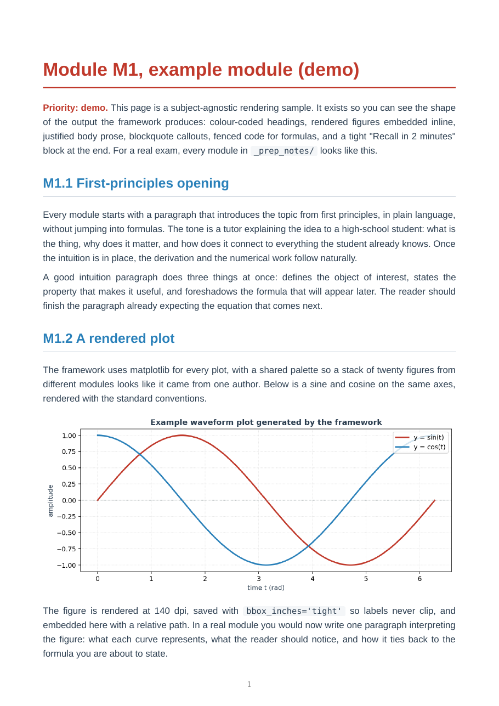
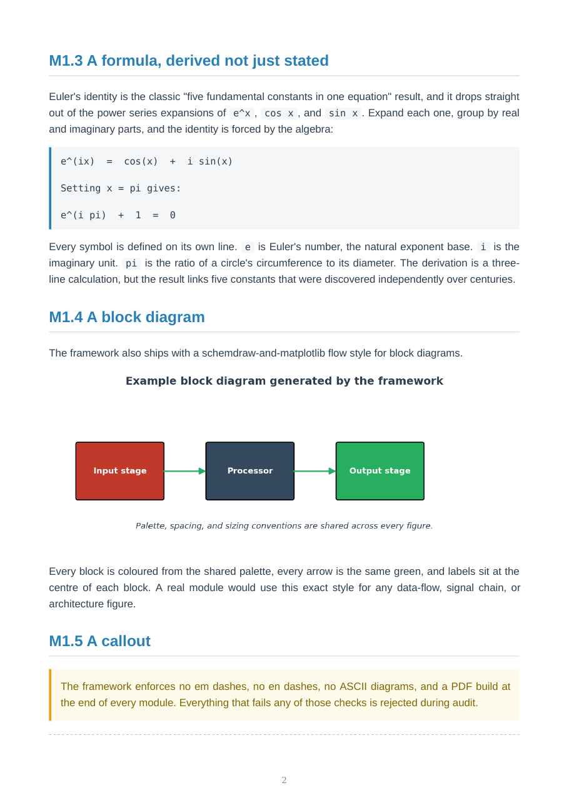

# claude-exam-prep

A reusable framework for turning Claude Code into a private exam tutor.

The system was distilled from a real overnight end-sem prep run, where, in a single session, Claude Code turned a folder full of raw lecture PDFs, slide decks, and homework assignments into a clean set of professor-separated module notes, rendered diagrams, cheat sheets, and printable PDFs. This repo codifies the workflow so every future exam starts with the same scaffolding, conventions, and quality bar, regardless of subject or course.

## What the output looks like

Every module ends up as a styled A4 PDF with colour-coded headings, justified prose, rendered figures from a shared palette, fenced code for formulas, and a tight recall block at the end:





(Sample rendered from the demo module shipped in this repo. Your real modules follow the same structure but with your subject's content.)

## What the system gives you

- A repeatable directory layout per exam (`Professor1_XYZ/` + `Professor2_ABC/` + `_prep_notes/`).
- A master `CLAUDE.md` that tells Claude Code how to behave as a tutor: teach from first principles, refuse to rely on weak source PPTs, generate real rendered diagrams instead of ASCII, build a PDF for every module, and adapt content style to each professor's grading model.
- Ready-to-use Python helpers for markdown-to-PDF (`md_to_pdf.py`), matplotlib diagrams with a consistent palette (`figure_helpers.py`), and coverage audits (`audit.py`).
- Markdown templates for a per-exam `CLAUDE.md`, module notes, cheat sheets, and figure generator scripts.
- Documentation of the teaching rules, diagram conventions, and the "volume vs precision" grading model that lets you align answers with each professor's preferences.

## Quick start

```bash
# one-time setup
git clone <this-repo> claude-exam-prep
cd claude-exam-prep
python3 -m pip install -r requirements.txt

# verify system graphviz is installed (for FSM, flow, topology diagrams)
which dot   # should print a path; if not: sudo apt-get install graphviz

# scaffold a new exam
python3 scripts/setup_exam.py --name "DSP_EndSem_2026"

# dump your lectures / homework / past papers here
cp -r /path/to/raw/* exams/DSP_EndSem_2026/raw/

# change into the exam directory and open Claude Code
cd exams/DSP_EndSem_2026
claude
```

When Claude Code opens, it will read `/home/<you>/claude-exam-prep/CLAUDE.md` (the master methodology) and `./CLAUDE.md` (this exam's tracker). It will then ask you a few clarifying questions (exam date, professors, marks split, which syllabus) and kick off the prep workflow.

## Directory layout

```
claude-exam-prep/
├── CLAUDE.md                 master methodology Claude reads on every session
├── README.md                 this file
├── requirements.txt          Python dependencies
├── scripts/                  reusable Python helpers
│   ├── setup_exam.py         scaffolds a new exam under exams/<name>/
│   ├── md_to_pdf.py          markdown -> styled A4 PDF with embedded images
│   ├── figure_helpers.py     matplotlib palette, setup, arrow, box helpers
│   └── audit.py              grep-based submodule coverage audit
├── templates/                files copied by setup_exam.py into a new exam
│   ├── CLAUDE.md             per-exam tracker template
│   ├── module.md             per-module note template
│   ├── cheatsheet.md         per-professor cheat sheet template
│   ├── gen_figs.py           per-module figure generator template
│   └── README.md             per-exam readme template
├── docs/                     methodology docs; read before your first exam
│   ├── workflow.md           end-to-end usage walkthrough
│   ├── teaching_rules.md     the rules Claude is asked to follow
│   ├── diagram_conventions.md palette, sizing, library-per-diagram mapping
│   └── prof_grading_modes.md volume-grader vs precision-grader model
└── exams/                    your per-exam working directories go here
    └── <exam_name>/          created by scripts/setup_exam.py
```

## The model in one paragraph

Every exam is organised into per-professor folders, each professor's syllabus is broken into numbered modules with explicit submodules (every HW question and every past-paper question maps to one), every module has a markdown note with embedded rendered diagrams, every module gets a PDF, and every professor gets a final cheat sheet whose style is tuned to how that professor grades. Two clear modes of grading surfaced during the prototype run and are now baked in as presets:

- **Volume grader** (marks scale with the amount of correct content). Answers are long, derivations are written out in full, each is closed with a cited standard or regulation plus a practical-notes and trade-off paragraph.
- **Precision grader** (marks scale with technical correctness). Answers are tight, they start with the formal tuple or definition, every iteration is shown, every formula is exact, one-line conclusions close each part.

See `docs/prof_grading_modes.md` for details.

## License

MIT, do whatever you want. The methodology is the point; reuse it widely.
